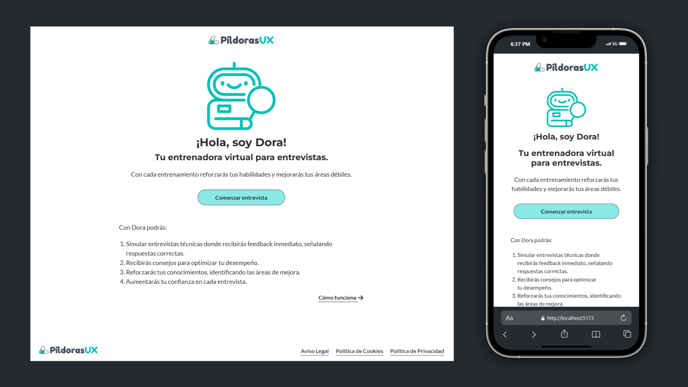

# 💼 AdoptaUnJunior - Entrenador de Entrevistas

Repositorio de Frontend para el proyecto **Entrenador de Entrevistas**, desarrollado en el marco de la **2a Edición de los Grupos de Trabajo** organizados entre Agosto y Noviembre de 2024 por la asociación [Adopta un Junior](https://adoptaunjunior.es/)

#### [🔗 Repositorio de BackEnd](https://github.com/AdoptaUnJuniorPlatform/GT-TrainingInterview-Back)

## 📝 Brief del proyecto



A solicitud de **Gema Gutiérrez Medina**, de [Píldoras UX](https://pildorasux.com/), hemos desarrollado una plataforma diseñada para ayudar a los candidatos a prepararse para entrevistas de trabajo. Aunque inicialmente el enfoque estaba dirigido exclusivamente al perfil de UX/UI Designer, identificamos el potencial de esta herramienta para otros roles dentro del sector IT. Por ello, propusimos a la clienta ampliar su alcance a perfiles como Frontend Developer y Backend Developer, considerando su relevancia y afinidad con las competencias del equipo.

El desarrollo se centró en un MVP (Producto Mínimo Viable) que permite a los usuarios **practicar preguntas típicas de entrevistas en un formato de chat interactivo**. Las principales características del MVP incluyen:

- **Preguntas adaptadas a roles específicos:** UX/UI Designer, Frontend Developer y Backend Developer.
- **Niveles de experiencia configurables:** Junior, Semi-senior y Senior, para garantizar la relevancia de las preguntas según la etapa profesional del usuario.
- **Personalización temática:** Posibilidad de seleccionar áreas clave relacionadas con cada rol.

Esta plataforma busca no solo optimizar la preparación de los candidatos, sino también ofrecer una experiencia práctica y personalizada que los acerque al éxito en sus entrevistas.

## 📦 Instalación

Sigue los pasos a continuación para clonar y ejecutar el proyecto en tu máquina local:

#### 1. Clonar el repositorio

```bash
git clone https://github.com/AdoptaUnJuniorPlatform/GT-TrainingInterview-Front
cd gt-traininginterview-front

npm install # asegúrate de tener Node.js versión 18 o superior
```

#### 2. Configurar el entorno

Será necesario un archivo `.env` donde especificar la URL de la API a la que hacer las peticiones. Como vemos en el archivo `.env-example` será necesario asignar un valor a la variable `VITE_API_URL`

- Si hemos desplegado localmente el backend en nuestra máquina, `VITE_API_URL=http://localhost:5172/`
- Si preferimos conectar directamente con el despliegue de prueba en onrender: `VITE_API_URL=https://backend-ready-v1-0.onrender.com/`

#### 3. Ejecutar el proyecto en modo desarrollo

Inicia el servidor de desarrollo con:

```bash
npm run dev
```

El proyecto estará disponible en http://localhost:5173 (puerto predeterminado de Vite).

Para construir la versión de producción podemos ejecutar `npm run build` (los archivos generados estarán en la carpeta **dist**), y para previsualizar dicha versión de producción podremos usar el comando `npm run preview`

## ⚙ Tecnologías utilizadas

      

- [Zustand](https://zustand.docs.pmnd.rs/getting-started/introduction) para manejo del estado
- [React-Icons](https://react-icons.github.io/react-icons/) para los iconos
- [Highlight.js](https://highlightjs.org/) para formateo de código en las preguntas y respuestas relacionadas con roles y temas de desarrollo

## 📂 Estructura del proyecto

```
src/
├── assets/        # Archivos estáticos como imágenes, fuentes, etc.
├── components/    # Componentes reutilizables
├── pages/         # Componentes principales que representan páginas de la aplicación
├── services/      # Servicios para la comunicación con la API (implementados con Axios)
├── store/         # Estado global de la aplicación (gestión con Zustand)
├── styles/        # Archivos globales de estilos SCSS
├── types/         # Definiciones de tipos y interfaces de TypeScript
├── utils/         # Funciones utilitarias y helpers reutilizables
```

## 👩🏻‍💻 Equipo FrontEnd

- [Reyes Jerez](https://github.com/reyesjerez)
- [Marta Vilaseca](https://github.com/marta-vilaseca)
